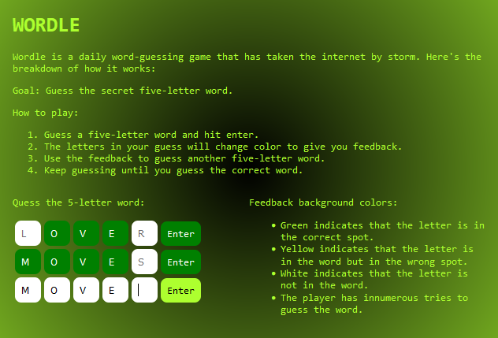

# Wordle

Wordle is a daily word-guessing game that has taken the internet by storm. Here's the breakdown of how it works:

Goal: Guess the secret five-letter word.

This project was generated with [Angular CLI](https://github.com/angular/angular-cli) version 16.2.6.

## Development server

Run `ng serve` for a dev server. Navigate to `http://localhost:4200/`. The application will automatically reload if you change any of the source files.

## Build

Run `ng build` to build the project. The build artifacts will be stored in the `dist/` directory.
